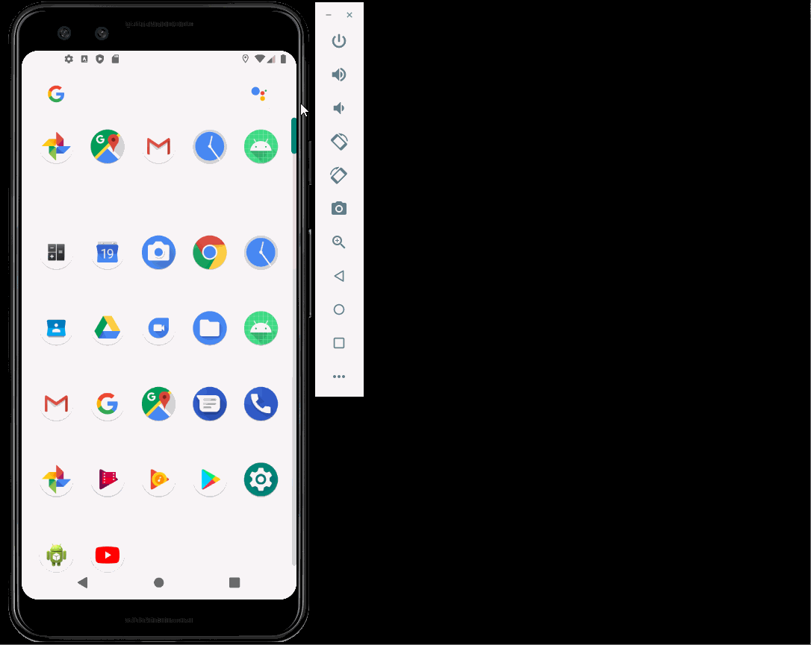

# Flix
Flix is an app that allows users to browse movies from the [The Movie Database API](http://docs.themoviedb.apiary.io/#).

## Flix Part 2

### User Stories

#### REQUIRED (10pts)

- [x] (8pts) Expose details of movie (ratings using RatingBar, popularity, and synopsis) in a separate activity.
- [x] (2pts) Allow video posts to be played in full-screen using the YouTubePlayerView.

#### BONUS

- [x] Implement a shared element transition when user clicks into the details of a movie (1 point).
- [ ] Trailers for popular movies are played automatically when the movie is selected (1 point).
  - [ ] When clicking on a popular movie (i.e. a movie voted for more than 5 stars) the video should be played immediately.
  - [ ] Less popular videos rely on the detailed page should show an image preview that can initiate playing a YouTube video.
- [ ] Add a play icon overlay to popular movies to indicate that the movie can be played (1 point).
- [ ] Apply data binding for views to help remove boilerplate code. (1 point)
- [x] Add a rounded corners for the images using the Glide transformations. (1 point)

### App Walkthough GIF

 

### Notes

Describe any challenges encountered while building the app.

A huge challenge for this week was understanding more on how to improve the UI such as the
image transformations. Some issues were ran into when trying to round the image corners. The image
size and position would offset drastically, but were soon solved by helpful resources given. Only
a couple of bonus stories were done, but I also added in another UI change that wasn't included
in the bonus. If there's any movie title or overview that is too long for the space given, an
ellipsis will be shown but the full information will be shown in that movie's specific view upon
clicking on it. This way there will be a uniform look amongst all movies in the list view instead
of any offsetting caused by long descriptions.

## Open-source libraries used
- [Android Async HTTP](https://github.com/codepath/CPAsyncHttpClient) - Simple asynchronous HTTP requests with JSON parsing
- [Glide](https://github.com/bumptech/glide) - Image loading and caching library for Android

---

## Flix Part 1

### User Stories

#### REQUIRED (10pts)
- [x] (10pts) User can view a list of movies (title, poster image, and overview) currently playing in theaters from the Movie Database API.

#### BONUS
- [x] (2pts) Views should be responsive for both landscape/portrait mode.
   - [x] (1pt) In portrait mode, the poster image, title, and movie overview is shown.
   - [x] (1pt) In landscape mode, the rotated alternate layout should use the backdrop image instead and show the title and movie overview to the right of it.

- [ ] (2pts) Display a nice default [placeholder graphic](https://guides.codepath.org/android/Displaying-Images-with-the-Glide-Library#advanced-usage) for each image during loading
- [x] (2pts) Improved the user interface by experimenting with styling and coloring.
- [ ] (2pts) For popular movies (i.e. a movie voted for more than 5 stars), the full backdrop image is displayed. Otherwise, a poster image, the movie title, and overview is listed. Use Heterogenous RecyclerViews and use different ViewHolder layout files for popular movies and less popular ones.

### App Walkthough GIF

 

### Notes
My main challenge was the designing of the UI such as changing colors and layout styles. Finding where exactly to change these properties took a bit of time and extra research.
Another challenge was calling the Configuration API to get the poster sizes. Since it was mentioned in the videos that the best way to get the poster's url path was through calling the API, I decided to try it on my own.
The challenge was mainly figuring out where I should pass in the received information, whether through the static Movie function or setting each Movie object's field in a setter method. Ultimately I decided to do it through the static
in order to reduce the time spent calling the movies list; hence, the poster paths would be set on the Movie object creation.
Overall, this was a fun starter project to get my feet wet in Android development.

### Open-source libraries used

- [Android Async HTTP](https://github.com/codepath/CPAsyncHttpClient) - Simple asynchronous HTTP requests with JSON parsing
- [Glide](https://github.com/bumptech/glide) - Image loading and caching library for Androids
